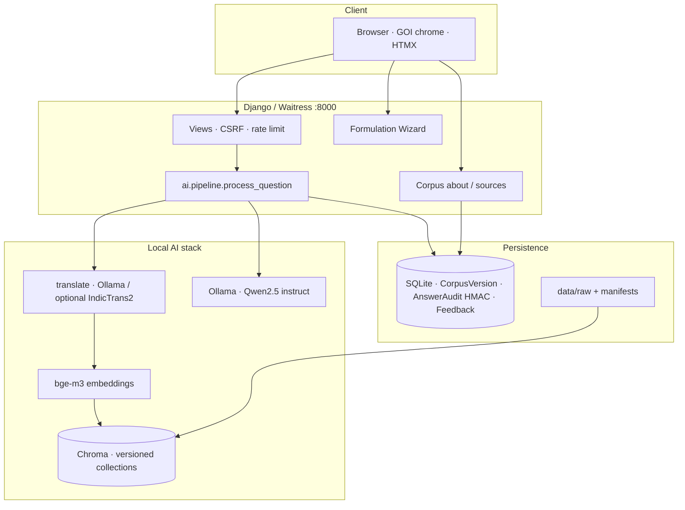
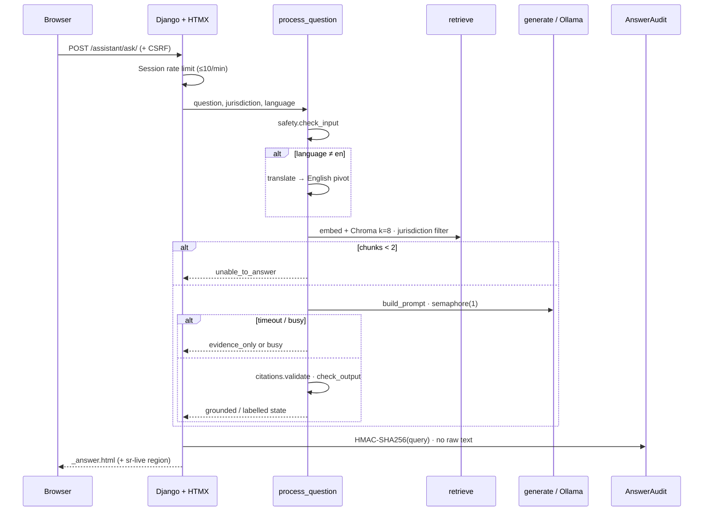
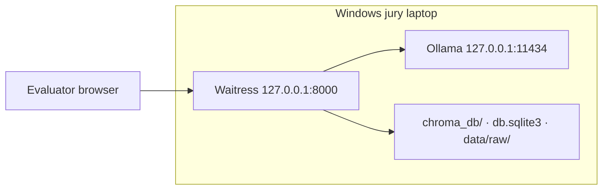
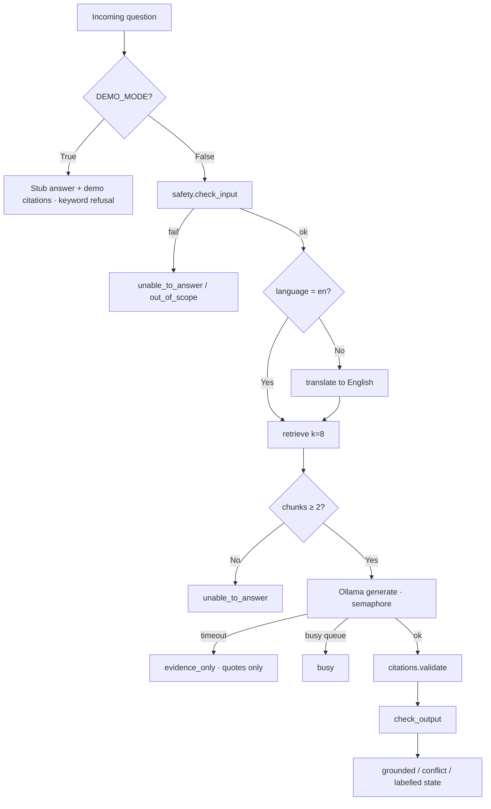
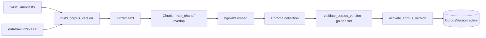

# IP-SAKTI Sahayak — Project Documentation

**Smart India Hackathon Problem Statement ID:** SIH26045  
**Product name:** IP-SAKTI Sahayak  
**Sponsoring organisation:** Ministry of Ayush / All India Institute of Ayurveda (AIIA)  
**Document type:** Technical & product documentation (jury / evaluators)  
**Corpus profile (demo):** `0.3-demo` · Cloud metadata seed: `0.3-cloud`  

---

## 1. Problem statement alignment

Ayurveda practitioners, researchers, MSMEs and students routinely need orientation on Indian intellectual property and related regulatory instruments — Patents Act exclusions for traditional knowledge, geographical indications, biological diversity / access and benefit sharing (ABS), Drugs & Cosmetics provisions for Ayurvedic drugs, FSSAI Ayurveda Aahara rules, and international baselines such as Nagoya and TRIPS. Existing search tools either return uncited generative text, mix foreign jurisdictions without warning, or require specialist legal databases.

SIH26045 asks for an **India-first**, **source-grounded**, **multilingual** assistant that can be demonstrated on a laptop without dependence on commercial closed APIs (OpenAI / Gemini). IP-SAKTI Sahayak answers that requirement by:

- retrieving only from a **versioned, curated corpus** of Indian statutes, rules, and selected open treaties;
- returning answers with **server-validated citations** (chunk IDs that must appear in the retrieved set);
- **refusing** unsafe, out-of-scope, or under-evidenced questions rather than inventing law;
- exposing **GOI-style** UI chrome, Hindi-verified interface strings, and GIGW-oriented accessibility;
- running **locally** with Ollama + Chroma + SQLite for offline-capable jury demonstration.

The product is an **information assistant**, not legal, medical, or regulatory advice, and not a filing portal.

---

## 2. Objectives and non-objectives

### 2.1 Objectives (MVP)

| ID | Objective | Jury evidence |
|----|-----------|---------------|
| O1 | Cited Q&A on Indian Ayurveda-related IP / TK / ABS / ASU regulation | Ask IP-SAKTI → grounded answer + Patents Act / GI / BDA / Aahara citations |
| O2 | Deterministic pathway guidance for formulation IP strategy | Formulation Wizard (4 steps) |
| O3 | Honest multilingual posture (22 Eighth Schedule languages selectable; EN/HI verified chrome) | Language selector + Hindi corpus/nav strings |
| O4 | Safe refusal and evidence thresholds | Foreign USPTO / crypto probes → refuse; &lt;2 chunks → unable_to_answer |
| O5 | Privacy-minimising audit (DPDP-aligned) | HMAC query fingerprint only; Clear Session |
| O6 | Offline-capable laptop demo | Waitress + local Ollama + local Chroma |

### 2.2 Non-objectives

- Substituting a licensed advocate, patent agent, or Ayurvedic practitioner.
- Equal-quality answer generation in all 22 languages in the MVP.
- Full India Code consolidations shipped in git (raw PDFs are gitignored; demo uses curated excerpts).
- Multi-tenant production SaaS, GPU cluster training, or fine-tuned legal LLMs.
- Advice on foreign domestic filing (USPTO, EPO, etc.) as if it were Indian law.

---

## 3. Stakeholders and users

| Role | Need |
|------|------|
| Jury / evaluators | Traceable demos, health endpoint, refusal behaviour, a11y |
| Ayurveda innovators / MSMEs | Fast orientation with citations |
| Students / researchers | Corpus transparency and source list |
| AIIA / Ministry of Ayush | GOI visual language, privacy posture, controllable corpus |
| Operators (team) | Build/validate/activate corpus, warmup scripts, DEMO_MODE fallback |

---

## 4. Solution overview

IP-SAKTI Sahayak is a Django web application with HTMX partial updates for chat. Questions flow through a gated RAG pipeline: input safety → optional translation to English → dense retrieval (bge-m3 + Chroma) → evidence gate → local LLM generation (Ollama/Qwen) → citation validation → output safety. Parallel features include a rule-based Formulation Wizard and corpus trust pages. Configuration is environment-driven (`.env`); jury live path uses `DEMO_MODE=False` with corpus `0.3-demo`.



---

## 5. System architecture

### 5.1 Logical layers

| Layer | Responsibility | Primary paths |
|-------|----------------|---------------|
| Presentation | Templates, GOI CSS tokens, HTMX swaps, a11y bar, theme | `core/templates/`, `core/static/`, `chat/templates/` |
| Application | HTTP routing, forms, session chat history (4 turns), wizard state | `core/`, `chat/`, `wizard/`, `corpus/views.py` |
| AI services | Pipeline, retrieve, generate, citations, safety, translate | `ai/` (plain package — not in `INSTALLED_APPS`) |
| Corpus ops | Ingest, chunk, embed, validate golden set, activate version | `corpus/ingestion.py`, management commands |
| Infrastructure | Waitress/Gunicorn, WhiteNoise, CSP, SQLite WAL, Chroma files | `ip_sakti/settings.py`, `scripts/` |

### 5.2 Request path for Ask



### 5.3 Deployment profile (laptop jury)



Single Waitress listener only — a second process on `:8000` causes stale UI / CSRF failures. Render/Docker profiles exist (`Procfile`, `render.yaml`, `docker-compose.yml`) with `DEMO_MODE=True` until a corpus and Ollama are provisioned.

---

## 6. Technology stack

| Concern | Choice | Notes |
|---------|--------|-------|
| Language runtime | Python 3.11+ (`runtime.txt` 3.11.9) | |
| Web framework | Django ≥5.1,&lt;6 | `django-htmx`, `django-csp` |
| UI | Server templates + HTMX + small vanilla JS | GSAP / DotLottie self-hosted; reduced-motion aware |
| WSGI | Waitress (Windows demo), Gunicorn (Linux) | |
| Static | WhiteNoise CompressedManifest | |
| LLM | Ollama · `qwen2.5:3b-instruct-q4_K_M` (CPU jury) | Plan also documents 7B where hardware allows |
| Embeddings | `BAAI/bge-m3` · sentence-transformers | `EMBED_DEVICE=cpu` or `cuda` |
| Vector store | Chroma persistent | `CHROMA_PERSIST_DIR` |
| Translation | `TRANSLATE_BACKEND=ollama` (demo) · IndicTrans2 optional | See §11 |
| RDBMS | SQLite + WAL | busy timeout 5s |
| PDF/TXT ingest | pypdf, pdfminer.six, PyYAML manifests | |
| Config | `python-dotenv` · `.env` | Never commit secrets |

Explicit constraint: **no OpenAI / Gemini** API keys in the MVP path.

---

## 7. Application modules

### 7.1 Package map

| Package | Role |
|---------|------|
| `ip_sakti/` | Settings, root URLconf, WSGI |
| `core/` | Home, health, language switch, privacy/terms/help/contact, screen-reader, static assets, `check_system` / `warmup` commands |
| `chat/` | Ask UI, ask/cancel/session-clear/feedback endpoints, `AnswerAudit`, `Feedback` |
| `corpus/` | `CorpusVersion`, `SourceManifest`, ingestion, about/sources pages, build/validate/activate/list commands |
| `wizard/` | Four-step formulation pathway (product → goal → jurisdiction → existing IP) |
| `ai/` | `pipeline`, `retrieve`, `generate`, `citations`, `safety`, `translate` |
| `locale/hi/` | Verified Hindi UI strings (`django.po` / `django.mo`) |
| `data/` | Manifests, raw corpus (gitignored), golden questions, source acquisition notes |
| `scripts/` | `serve_demo.ps1`, `warmup.ps1`, `demo_checklist.ps1`, corpus PDF helpers |
| `tests/` | Pytest suite (~43 tests) |

### 7.2 Primary routes

| Path | Name | Purpose |
|------|------|---------|
| `/` | `core:home` | Landing / onboarding |
| `/health/` | `core:health` | JSON readiness |
| `/language/set/` | `core:set_language` | Language cookie |
| `/assistant/` | `chat:chat` | Chat surface |
| `/assistant/ask/` | `chat:ask` | HTMX ask |
| `/assistant/cancel/` | `chat:cancel` | Cancel generation |
| `/assistant/session-clear/` | `chat:session_clear` | Wipe session history |
| `/assistant/feedback/` | `chat:feedback` | Thumbs feedback |
| `/wizard/`, `/wizard/step/`, `/wizard/result/`, `/wizard/reset/` | `wizard:*` | Pathway wizard |
| `/corpus/about/`, `/corpus/sources/` | `corpus:*` | Trust & source list |
| `/screen-reader/`, `/privacy/`, `/terms/`, `/help/`, `/contact/` | `core:*` | A11y & legal pages |
| `/admin/` | Django admin | Operator console |

---

## 8. RAG pipeline (detailed)

Entry point: `ai.pipeline.process_question(question, jurisdiction="IN", language_code="en", corpus_version=…)`.

### 8.1 Control flow



### 8.2 Stage notes

1. **Safety (`ai/safety.py`)** — Length 5–1000 characters; blocks emails, Aadhaar-like patterns, phones; blocks prompt-injection patterns; foreign-law / personalised-filing probes may map to refusal states.
2. **Translation (`ai/translate.py`)** — Non-English UI language pivots retrieval to English. Demo default: Ollama instruction translate (`TRANSLATE_BACKEND=ollama`). IndicTrans2 models may be present but are not quality-green on transformers 5.16 (see §11).
3. **Retrieve (`ai/retrieve.py`)** — Embed with bge-m3; query active Chroma collection; filter by jurisdiction metadata (`IN`, `INT`; `BOTH` disables filter); dedupe toward ~4–5 passages.
4. **Evidence gate** — Fewer than two usable chunks → refuse rather than hallucinate.
5. **Generate (`ai/generate.py`)** — Structured prompt with excerpts; Ollama `/api/chat`; `BoundedSemaphore(1)`; at most two waiters (~5s) else `busy`; cancel token support.
6. **Citations (`ai/citations.py`)** — Each claimed citation must reference a retrieved `chunk_id`, carry a locator/section where available, and pass term-overlap checks.
7. **Output safety** — Empty, oversized, or PII-bearing outputs are rejected or rewritten to safe states.

### 8.3 Answer states

`grounded` · `evidence_only` · `unable_to_answer` · `out_of_scope` · `conflict` · `busy` · `unavailable` · `demo` · `cancelled`

UI maps these to distinct cards so the jury can see **refusal as a feature**.

### 8.4 Local vs Railway (deploy truth)

| Capability | Local (indexed) | Railway public app |
|---|---|---|
| UI + About corpus | Yes | Yes (`0.3-cloud` metadata) |
| Ollama generation | Local Ollama | Cloud `ollama` service |
| Chroma + bge-m3 retrieve | Yes, after `build_corpus_version` | **Not provisioned yet** |
| Full cited RAG | Yes | **No** until Chroma is synced to `/data` |

Operator detail: **[docs/RAG.md](RAG.md)**.

---

## 9. Corpus management

### 9.1 Design principles

- Every ingestible document has a YAML manifest under `data/manifests/<source_id>.yaml`.
- Binary/text sources live in `data/raw/` (**gitignored**); SHA-256 recorded on ingest.
- Collections are versioned: Chroma name `ip_sakti_v{version_with_underscores}` (e.g. `ip_sakti_v0_3-demo`).
- Lifecycle: `building → validated → active → retired | failed`. Exactly one `active` version.

### 9.2 Ingest pipeline



### 9.3 Operator commands

```powershell
python manage.py build_corpus_version 0.3-demo --sources data/raw --manifests data/manifests
# --force · --max-chars 1200 · --overlap-chars 150
python manage.py validate_corpus_version 0.3-demo
python manage.py activate_corpus_version 0.3-demo
python manage.py list_corpus_versions
```

### 9.4 Jury corpus `0.3-demo`

| Metric | Value |
|--------|-------|
| Sources | 8 |
| Chunks | 43 (representative demo index) |
| Golden retrieval | Validated against `data/golden/golden_questions.json` |
| Content form | Curated TXT excerpts suitable for laptop demo; full India Code PDFs optional via acquisition guide |

| source_id | Domain |
|-----------|--------|
| `patents-act-1970` | Patents (incl. §3(p) TK exclusion) |
| `gi-act-1999` | Geographical Indications |
| `biological-diversity-act-2002` | ABS / NBA |
| `drugs-cosmetics-act-1940` | ASU drugs framework |
| `ayurveda-aahara-regs-2022` | FSSAI Ayurveda Aahara |
| `nagoya-protocol` | International ABS |
| `trips-agreement` | International IP baseline |
| `tkdl` | Public / about TKDL only (full DB restricted) |

Authoritative portals and licence notes: `data/CORPUS_SOURCES.md`, `LICENCES.md`.

### 9.5 Trust UI

- `/corpus/about/` — Active version, priority tiers (P0/P1), coverage limitations (i18n).
- `/corpus/sources/` — Full source list for transparency.

---

## 10. Product features

### 10.1 Ask IP-SAKTI

- Jurisdiction chips / filters (India / international / both as implemented).
- Pending turn UX: user question echoed + “finding” animation until swap.
- Screen-reader live region (`#sr-live`) and focus management after answer.
- Cancel in-flight generation; Clear Session (CSRF-safe via HTMX headers).
- Feedback thumbs persisted without storing raw question text in audit rows.

### 10.2 Formulation Wizard

Deterministic four-step flow (`wizard/forms.py`, `TOTAL_STEPS=4`):

1. Product / formulation type  
2. Goal (protect / commercialise / comply, etc.)  
3. Jurisdiction focus  
4. Existing IP posture  

Result page recommends pathway categories (e.g. patentability caution around TK, GI, ABS filings, ASU licensing) with links back into Ask — **not** a substitute for Rule-level examination.

### 10.3 GOI presentation & accessibility

- Tricolour bar, national emblem / Ashoka Chakra (dark-theme visibility addressed).
- Ministry of Ayush / AIIA header co-branding.
- Accessibility bar: skip link, font size A+/A/A−, light/dark theme.
- `/screen-reader/` — NVDA/JAWS oriented guidance (GIGW-aligned).
- `prefers-reduced-motion` respected for animation-heavy chrome.

### 10.4 Internationalisation

- All 22 Eighth Schedule languages appear in the selector (`settings.LANGUAGES`).
- **Verified UI:** English, Hindi (django catalog).
- **Pilot:** remaining languages — preference stored; chrome/answers not claimed equal quality.
- Django 5 language activation via **`django_language` cookie** (`LocaleMiddleware`).

---

## 11. Translation subsystem

| Backend | Setting | Role |
|---------|---------|------|
| Ollama (default for jury) | `TRANSLATE_BACKEND=ollama` | Instruction-style hi↔en (and other mapped codes) via Qwen |
| Auto | `TRANSLATE_BACKEND=auto` | Try IndicTrans2; quality-gate; fall back to Ollama |
| IndicTrans2 | models `indictrans2-indic-en-1B` / `en-indic-1B` | Optional; requires `HF_TOKEN` for gated download |

**Honest status:** Local patches allow IndicTrans2 **load** under transformers 5.x (tokenizer `_special_tokens_map`, `tie_weights(**kwargs)`, `_supports_default_dynamic_cache → False`). **Generation quality remains unreliable** on transformers 5.16 (degenerate repetition even under teacher forcing). sentence-transformers 6 requires transformers ≥5, so the shared venv cannot pin transformers 4.x. Jury path therefore uses **Ollama translation**. Details: `docs/INDICTRANS.md`.

---

## 12. Security, privacy, and compliance posture

| Control | Implementation |
|---------|----------------|
| CSRF | Django middleware; HTMX reads non-HttpOnly CSRF cookie; session-clear covered by tests |
| CSP | `django-csp`; self defaults; script nonce support |
| Cookies | `SameSite=Strict`; Secure when not `DEBUG` |
| Rate limit | Session sliding window `RATE_LIMIT_ASK_PER_MIN` (default 10) → 429 busy partial |
| Generation concurrency | Single Ollama semaphore; bounded waiters |
| Audit | HMAC-SHA256 of query with `AUDIT_HMAC_KEY` / `AUDIT_HMAC_KEY_ID` — **raw question not stored** in `AnswerAudit` |
| Session history | Last 4 turns ephemeral; Clear Session deletes |
| Ollama binding | Loopback `127.0.0.1:11434` |
| Secrets | `.env` gitignored; rotate any token ever pasted into chat (e.g. HF) |
| DPDP messaging | Privacy page + in-UI warnings against pasting personal data |
| Health | Public JSON readiness — no secret material |

---

## 13. Configuration reference

| Variable | Purpose | Jury typical |
|----------|---------|--------------|
| `SECRET_KEY` | Django secret | Strong random |
| `DEBUG` | Debug pages | `False` |
| `ALLOWED_HOSTS` | Host allowlist | `127.0.0.1,localhost` |
| `DEMO_MODE` | Stub RAG if True | `False` live / `True` backup |
| `OLLAMA_BASE_URL` | Ollama HTTP | `http://127.0.0.1:11434` |
| `OLLAMA_MODEL` | Instruct model | `qwen2.5:3b-instruct-q4_K_M` |
| `OLLAMA_TIMEOUT` | Seconds | 45–180 |
| `EMBED_MODEL` | Embedding id | `BAAI/bge-m3` |
| `EMBED_DEVICE` | cpu/cuda | `cpu` |
| `CHROMA_PERSIST_DIR` | Vector path | `./chroma_db` |
| `AUDIT_HMAC_KEY` | Audit HMAC | Rotated secret |
| `AUDIT_HMAC_KEY_ID` | Key id | `v1` |
| `RATE_LIMIT_ASK_PER_MIN` | Ask throttle | `10` |
| `TRANSLATE_BACKEND` | Translate path | `ollama` |
| `HF_TOKEN` | Optional HF gated models | Set only if using IndicTrans download |

---

## 14. Local runbook (jury laptop)

```powershell
cd C:\IP-SAKTI-Sahayak
.\.venv\Scripts\Activate.ps1
# Ensure .env: DEMO_MODE=False, DEBUG=False, OLLAMA_MODEL=..., TRANSLATE_BACKEND=ollama

# Terminal A
$env:OLLAMA_HOST="127.0.0.1:11434"
ollama serve
# ollama pull qwen2.5:3b-instruct-q4_K_M   # once

# Terminal B
.\scripts\warmup.ps1
.\scripts\serve_demo.ps1          # ONE Waitress on :8000
.\scripts\demo_checklist.ps1
```

Health check: `GET http://127.0.0.1:8000/health/` must show `status=ok`, `demo_mode=false`, `debug=false`, `ollama_reachable=true`, `active_corpus_version=0.3-demo`.

Fresh install outline: create venv → `pip install -r requirements.txt` → copy `.env.example` → `migrate` → build/activate corpus → pull Ollama model → serve.

---

## 15. Demonstration script (summary)

Condensed live flow (~8–10 minutes):

1. Home — optional Hindi switch; GOI chrome.  
2. Ask — Section 3(p) / TK chip → pending UX → grounded + Patents Act citation.  
3. Second grounded path — Aahara or NBA/ABS.  
4. Refusal — USPTO / unrelated domain.  
5. Clear Session.  
6. Screen Reader Access + dark theme (Ashoka visible).  
7. Optional Wizard header (pathway, not deep examination).  

**If Ask is slow:** state CPU latency (~1–2 min warm); `evidence_only` with quotes remains a valid outcome.  
**If Ollama is unavailable:** set `DEMO_MODE=True`, restart the app, show stub answers and explain the live path separately.

**Do not claim:** equal Pilot-language UI quality; full statute PDFs in-repo; instant cold-start answers.

---

## 16. Testing and quality gates

| Layer | Location | Coverage |
|-------|----------|----------|
| HTTP / HTMX | `tests/test_views.py` | Home, chat, wizard, corpus, health, CSRF clear-session, feedback, Hindi chrome |
| Ingestion | `tests/test_ingestion.py` | Section detect, TXT extract, chunk metadata |
| Safety | `tests/test_safety.py` | Length, PII, injection |
| Golden retrieval | `data/golden/golden_questions.json` | `validate_corpus_version` |
| Operator | `check_system`, `demo_checklist.ps1` | Runtime readiness |

Approximate automated suite size: **43** pytest functions (`pytest tests/ -v`). Config: `pytest.ini` → `DJANGO_SETTINGS_MODULE=ip_sakti.settings`.

---

## 17. Known limitations (evaluator-facing)

| Area | Status |
|------|--------|
| Corpus depth | Demo excerpts (`0.3-demo`); not complete India Code consolidations |
| Latency | CPU Ask often 50–120s; timeout may yield `evidence_only` |
| IndicTrans2 | Models downloadable; inference quality not jury-primary |
| Pilot languages | Selector only; not verified chrome/answers |
| Wizard | Pathway finder; not full regulatory examination |
| Network-off | Prefer warm models + optional backup video |
| Multi-process Chroma | Avoid multiple writers; single Waitress process |

---

## 18. Repository documentation map

| Document | Use |
|----------|-----|
| `README.md` | Entry point · live demo links |
| `QUICKSTART.md` | Local setup |
| `USER_GUIDE.md` | End-user oriented |
| `LICENCES.md` | Corpus & dependency licensing |
| `data/CORPUS_SOURCES.md` | Source acquisition |
| `docs/DEPLOY_OLLAMA.md` | Railway Ollama service |
| `docs/RAG.md` | RAG pipeline · local vs Railway deploy status |
| `docs/INDICTRANS.md` | Translation backend status |
| **This file** | Consolidated SIH technical documentation |

---

## 19. Future work (post-MVP)

1. Replace demo TXT with validated full PDFs; rebuild as `0.4-pdf` (or later) after SHA/golden gates.  
2. Dedicated translation environment or CTranslate2 export once transformers/IndicTrans align.  
3. GPU or 7B path for lower latency; optional streaming tokens.  
4. Expand Hindi (and selected Pilot) string coverage beyond chrome.  
5. Hardened public deployment (HTTPS, reverse proxy, secret rotation, monitoring).  
6. Richer citation UX (deep links to section anchors when licence allows).

---

## 20. Identification block for SIH submission

| Field | Value |
|-------|-------|
| Problem ID | SIH26045 |
| Title | IP-SAKTI Sahayak — Multilingual, source-cited IPR information assistant for Ayurveda & traditional knowledge |
| Organisation context | Ministry of Ayush / AIIA |
| Stack slogan | Django · HTMX · Chroma · bge-m3 · Ollama/Qwen · versioned corpus · validated citations |
| Demo URL (local) | `http://127.0.0.1:8000/` |
| Health | `http://127.0.0.1:8000/health/` |
| Active corpus | `0.3-demo` |
| Advice disclaimer | General information only — not legal, medical, or regulatory advice |

---

*End of document.*
